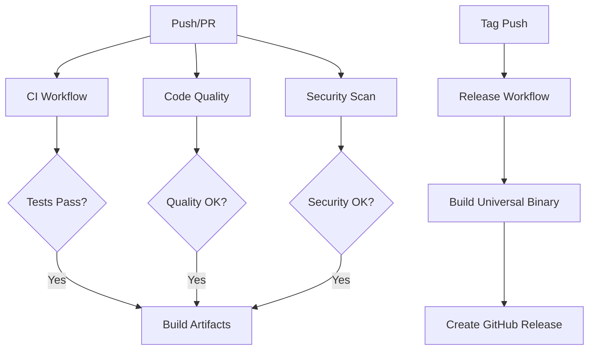

# GitHub Actions Workflows

This directory contains all the GitHub Actions workflows for sourcekit-bsp. Each workflow serves a specific purpose in our CI/CD pipeline.

## Workflows Overview

### 🏗️ CI Pipeline (`ci.yml` & `basic-ci.yml`)

**Main CI (`ci.yml`):**
- Advanced CI with full feature set
- Requires external service tokens (Codecov, etc.)

**Basic CI (`basic-ci.yml`):**
- Simplified CI that works without external dependencies
- Recommended for getting started

**Triggers:**
- Push to `main` and `develop` branches
- Pull requests to `main` branch

**Jobs:**
- **Build and Test**: Builds the project and runs tests
- **SwiftLint**: Enforces Swift coding standards (via Homebrew)
- **Basic Security**: Simple security pattern scanning
- **Build Release**: Creates release binaries (main branch only)

**Key Features:**
- Native macOS tools (no container dependencies)
- SPM dependency caching
- Artifact uploads for release binaries
- Works out of the box without tokens

### 🔍 Code Quality (`code-quality.yml`)

**Triggers:**
- Push to `main` and `develop` branches
- Pull requests to `main` branch

**Jobs:**
- **SwiftLint**: Comprehensive linting with strict mode
- **Swift Format**: Code formatting validation
- **Dependency Review**: Analyzes dependency changes in PRs
- **Security Scan**: Semgrep security analysis
- **Documentation**: Validates and generates documentation

**Security Features:**
- Hardcoded secrets detection
- Dependency vulnerability scanning
- Code pattern security analysis

### 🚀 Release (`release.yml`)

**Triggers:**
- Tag pushes matching `v*.*.*` pattern

**Features:**
- Universal binary builds (ARM64 + x86_64)
- Multiple archive formats (tar.gz, zip)
- SHA256 checksums generation
- Automatic release notes
- Pre-release detection

### 🛡️ Security (`security.yml`)

**Triggers:**
- Push to `main` branch
- Pull requests to `main` branch
- Daily scheduled runs at 2 AM UTC

**Jobs:**
- **Dependency Security**: Swift package vulnerability scanning
- **Code Security**: GitHub CodeQL analysis
- **Secret Scan**: TruffleHog secret detection
- **License Compliance**: FOSSA license scanning

## Environment Variables

### Required Secrets

| Secret | Purpose | Required For |
|--------|---------|-------------|
| `CODECOV_TOKEN` | Code coverage reporting | CI |
| `SEMGREP_APP_TOKEN` | Security scanning | Code Quality |
| `FOSSA_API_KEY` | License compliance | Security |

### Environment Variables

| Variable | Default | Description |
|----------|---------|-------------|
| `DEVELOPER_DIR` | `/Applications/Xcode_15.4.app/Contents/Developer` | Xcode developer directory |

## Badges

The following badges are available for the README:

```markdown
[](https://github.com/wang.lun/sourcekit-bsp/actions/workflows/ci.yml)
[](https://github.com/wang.lun/sourcekit-bsp/actions/workflows/release.yml)
[](https://github.com/wang.lun/sourcekit-bsp/actions/workflows/code-quality.yml)
[](https://github.com/wang.lun/sourcekit-bsp/actions/workflows/security.yml)
```

## Workflow Dependencies



## Configuration Files

### SwiftLint (`.swiftlint.yml`)

Comprehensive linting configuration with:
- 120 character line limit
- Function body length limits
- Naming conventions
- Custom rules for access control

### Swift Format

Automatic code formatting validation ensuring consistent style across the codebase.

## Optimization Features

### Caching
- Swift Package Manager dependencies
- Build artifacts between runs
- Documentation generation

### Matrix Builds
- Multiple Swift versions (5.9, 5.10)
- Platform-specific builds
- Configuration variations

### Artifact Management
- Build artifacts retention (30 days)
- Release binaries with checksums
- Documentation archives (7 days)

## Monitoring and Notifications

### Status Checks
- All workflows must pass for PR merges
- Release builds only trigger on successful CI
- Security scans run on schedule

### Notifications
- Failed builds notify maintainers
- Security alerts for vulnerabilities
- Release notifications to subscribers

## Maintenance

### Regular Updates
- Bump action versions quarterly
- Update Swift/Xcode versions as needed
- Review and update security policies

### Performance Monitoring
- Track workflow execution times
- Monitor artifact sizes
- Optimize caching strategies

## Troubleshooting

### Common Issues

1. **Build Failures**: Check Xcode/Swift version compatibility
2. **Security Scans**: Review and acknowledge false positives
3. **Release Failures**: Verify tag format matches `v*.*.*`
4. **Cache Issues**: Clear workflow caches if needed

### Debug Steps

1. Check workflow logs in Actions tab
2. Verify environment variables are set
3. Test locally with same Swift version
4. Review recent changes for breaking modifications

## Local Testing

Run equivalent commands locally:

```bash
# Build and test
swift build
swift test --enable-code-coverage

# Linting
swiftlint --strict
swift-format lint --recursive Sources Tests

# Security scan (basic)
grep -r "api_key\|token" Sources/ --include="*.swift"
```

This ensures your changes will pass CI checks before pushing.