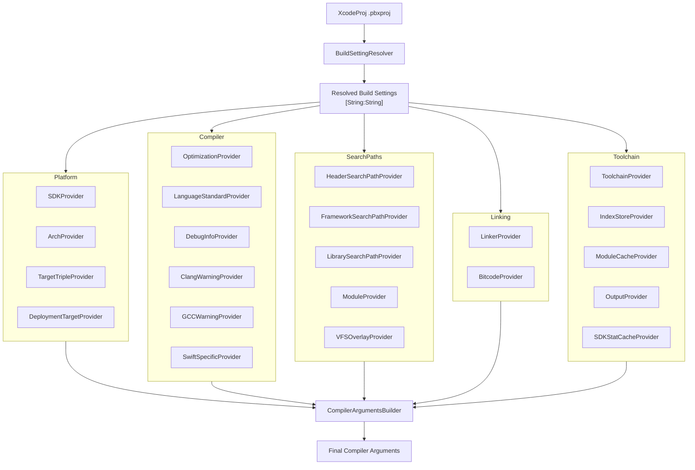

---

## 📌 CompilerFlagsProviders 清单

### 1. 平台相关 (Platform)
| Provider | 输入 Build Settings | 输出 Flags |
|----------|---------------------|------------|
| **SDKProvider** | `SDKROOT` | Swift: `-sdk`, Clang: `-isysroot` |
| **ArchProvider** | `ARCHS` | `-arch arm64`, `-arch x86_64` |
| **TargetTripleProvider** | `ARCHS`, `SDKROOT`, `IPHONEOS_DEPLOYMENT_TARGET`, `MACOSX_DEPLOYMENT_TARGET`, … | `-target arm64-apple-ios18.0-simulator` |
| **DeploymentTargetProvider** | 平台 Deployment Target | 已用于 triple 或单独暴露 |

### 2. 编译选项 (Compiler Options)
| Provider | 输入 Build Settings | 输出 Flags |
|----------|---------------------|------------|
| **OptimizationProvider** | `SWIFT_OPTIMIZATION_LEVEL`, `GCC_OPTIMIZATION_LEVEL` | `-Onone`, `-O2`, `-Os`，附带 `-enforce-exclusivity` |
| **LanguageStandardProvider** | `CLANG_CXX_LANGUAGE_STANDARD`, `CLANG_C_LANGUAGE_STANDARD`, `SWIFT_VERSION` | `-std=c++17`, `-std=c11`, `-swift-version 5` |
| **DebugInfoProvider** | `DEBUG_INFORMATION_FORMAT`, `GCC_GENERATE_DEBUGGING_SYMBOLS` | `-g`, `-gdwarf-2` |
| **ClangWarningProvider** | `CLANG_WARN_*` | `-Wdocumentation`, `-Wempty-body`, … |
| **GCCWarningProvider** | `GCC_WARN_*` | `-Wunused-variable`, `-Wshadow`, `-Werror`, … |
| **SwiftSpecificProvider** | `ENABLE_TESTABILITY`, `SWIFT_ACTIVE_COMPILATION_CONDITIONS`, `SWIFT_ENABLE_BATCH_MODE` | `-enable-testing`, `-DDEBUG`, `-enable-batch-mode` |
| **DefinesProvider** | `GCC_PREPROCESSOR_DEFINITIONS`, `SWIFT_ACTIVE_COMPILATION_CONDITIONS` | `-DDEBUG`, `-DFOO=1` |
| **BridgingHeaderProvider** | `SWIFT_OBJC_BRIDGING_HEADER` | `-import-objc-header …` |
| **ObjCProvider** | `CLANG_ENABLE_OBJC_ARC` | `-fobjc-arc`, `-fno-objc-arc` |

### 3. 搜索路径 (Search Paths)
| Provider | 输入 Build Settings | 输出 Flags |
|----------|---------------------|------------|
| **HeaderSearchPathProvider** | `HEADER_SEARCH_PATHS`, `USER_HEADER_SEARCH_PATHS`, `SYSTEM_HEADER_SEARCH_PATHS` | `-I`, `-iquote`, `-isystem` |
| **FrameworkSearchPathProvider** | `FRAMEWORK_SEARCH_PATHS` | `-F` |
| **LibrarySearchPathProvider** | `LIBRARY_SEARCH_PATHS` | `-L` |
| **ModuleProvider** | `CLANG_ENABLE_MODULES`, `PRODUCT_MODULE_NAME`, `PRODUCT_NAME` | `-fmodules`, `-fmodule-name Foo` |
| **VFSOverlayProvider** | DerivedData 下的 `.vfsoverlay` 文件 (Xcode 生成) | `-ivfsoverlay <path>` |

### 4. 链接相关 (Linking)
| Provider | 输入 Build Settings | 输出 Flags |
|----------|---------------------|------------|
| **LinkerProvider** | `OTHER_LDFLAGS`, `EXPORTED_SYMBOLS_FILE`, `DEAD_CODE_STRIPPING`, `LD_RUNPATH_SEARCH_PATHS` | `-lFoo`, `-exported_symbols_list`, `-Wl,-dead_strip`, `-rpath …` |
| **BitcodeProvider** | `ENABLE_BITCODE` | `-fembed-bitcode`, `-fno-embed-bitcode` |

### 5. 工具链与产物 (Toolchain & DerivedData)
| Provider | 输入 Build Settings | 输出 Flags |
|----------|---------------------|------------|
| **ToolchainProvider** | `TOOLCHAIN_DIR` | `-toolchain com.apple.dt.toolchain.XcodeDefault` |
| **IndexStoreProvider** | `INDEX_STORE_PATH`（或 DerivedData 推导） | `-index-store-path …` |
| **ModuleCacheProvider** | `MODULE_CACHE_DIR`（或 DerivedData 默认值） | `-module-cache-path …` |
| **OutputProvider** | `OBJECT_FILE_DIR`, `DERIVED_FILE_DIR` | `-o file.o`, `-emit-objc-header-path …` |
| **SDKStatCacheProvider** | DerivedData 下的 `.sdkstatcache` 文件 (Xcode 生成) | `-ivfsstatcache <path>` |

---

## 🎯 架构流程

## ✅ 总结

完整覆盖 `buildSettingsForIndex` 的 Providers 分类：

- **平台信息**：SDK / Arch / TargetTriple / DeploymentTarget 
- **编译选项**：Optimization / LanguageStandard / DebugInfo / Warnings / Swift 特性 / Defines / BridgingHeader / ObjC  
- **搜索路径**：Header / Framework / Library / Module  
- **链接**：Linker / Bitcode  
- **工具链 & DerivedData**：Toolchain / IndexStore / ModuleCache / Output  

---
EOF
